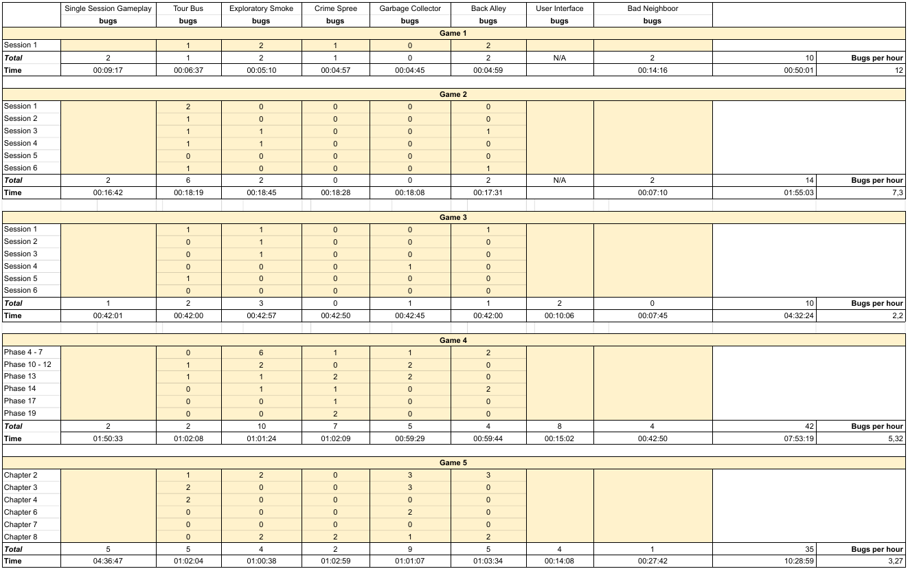

## Raw data of collected bugs and records of Exploratory Testing in Portal and Portal 2.

### The video records can be found [here](https://www.youtube.com/playlist?list=PLSdOb0Kges6CBIPut0MyoIUjSMFtdR9RS)

### Here is the overview table of all tests realized. All bugs found and their descriptions can be seen [here for Game 1](https://github.com/yohansan1/et-sessions/blob/main/tables/All%20Bugs%20Game%201.pdf), [here for Game 2](https://github.com/yohansan1/et-sessions/blob/main/tables/All%20Bugs%20Game%202.pdf), [here for Game 3](https://github.com/yohansan1/et-sessions/blob/main/tables/All%20Bugs%20Game%203.pdf), [here for Game 4](https://github.com/yohansan1/et-sessions/blob/main/tables/All%20Bugs%20Game%204.pdf) and [here for Game 5](https://github.com/yohansan1/et-sessions/blob/main/tables/All%20Bugs%20Game%205.pdf):

### Here are the tables of the bugs collected using all strategies:

#### [Tour Bus Strategy](https://github.com/yohansan1/et-sessions/blob/main/tables/Tour%20Bus%20Table.pdf)

#### [Exploratory Smoke Testing](https://github.com/yohansan1/et-sessions/blob/main/tables/Exploratory%20Smoke%20Table.pdf)

#### [Crime Spree Tour](https://github.com/yohansan1/et-sessions/blob/main/tables/Crime%20Spree%20Table.pdf)

#### [Garbage Collectors Tour](https://github.com/yohansan1/et-sessions/blob/main/tables/Garbage%20Collectors%20Table.pdf)

#### [Back Alley Strategy](https://github.com/yohansan1/et-sessions/blob/main/tables/Back%20Alley%20Table.pdf)

#### [User Interface](https://github.com/yohansan1/et-sessions/blob/main/tables/User%20Interface%20Table.pdf)

#### [Bad Neighborhood Tour (Games 1 to 3)](https://github.com/yohansan1/et-sessions/blob/main/tables/Bad%20Neighborhood%20Games%201%20to%203.pdf)

#### [Bad Neighborhood Tour (Games 4 and 5)](https://github.com/yohansan1/et-sessions/blob/main/tables/Bad%20Neighborhood%20Games%204%20and%205.pdf)
