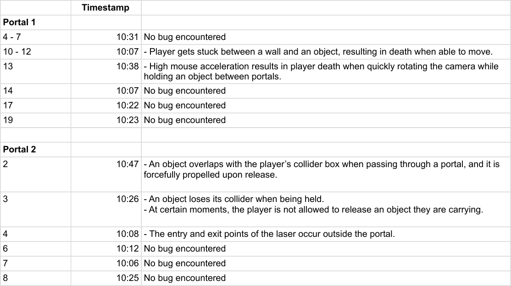
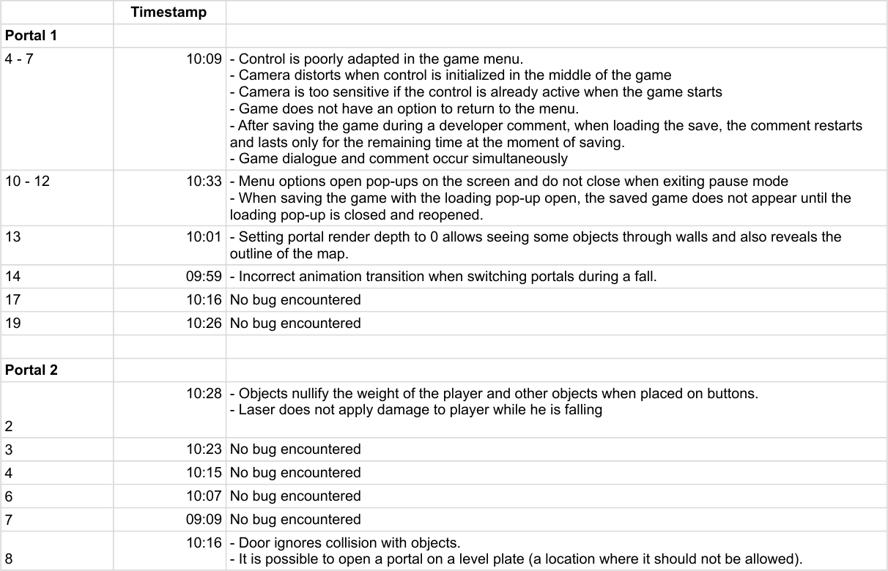
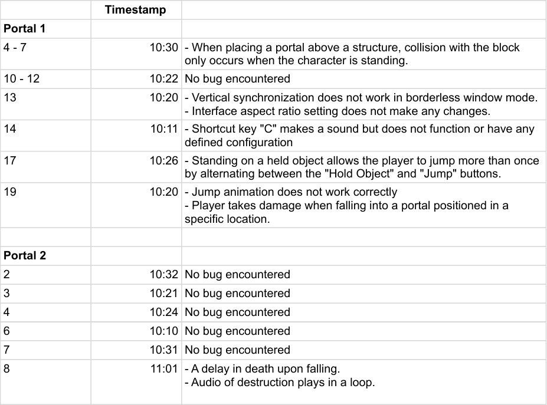
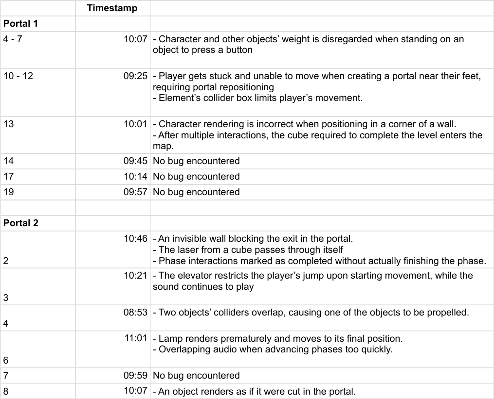
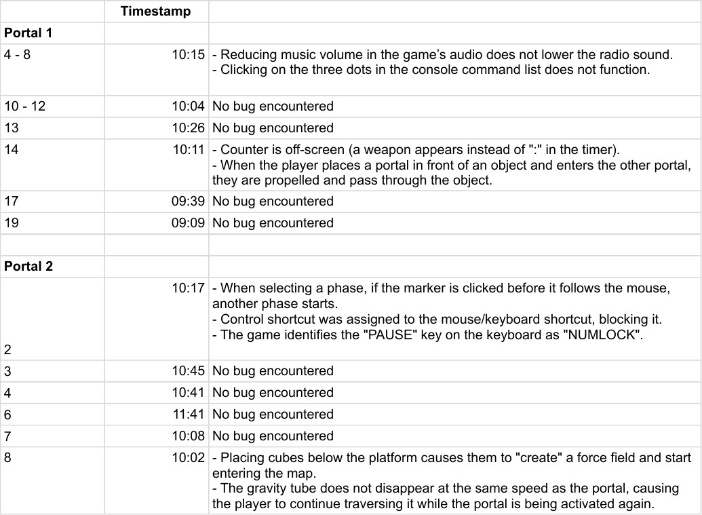
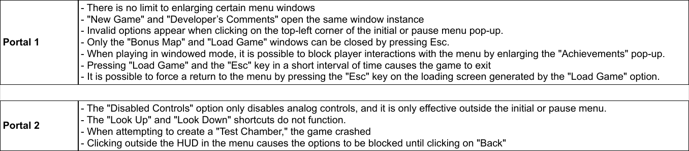

## Raw data of collected bugs and records of Exploratory Testing in Portal and Portal 2.

### The video records can be found [here](https://www.youtube.com/playlist?list=PLSdOb0Kges6CBIPut0MyoIUjSMFtdR9RS)

### Here is the overview table of all tests realised. All bugs found and their descriptions can be seen [here for Game 1](https://github.com/yohansan1/et-sessions/blob/main/tables/All%20Bugs%20Portal.pdf) and [here for Game 2](https://github.com/yohansan1/et-sessions/blob/main/tables/All%20Bugs%20Portal%202.pdf):

### Here are the tables of the bugs collected using all strategies:

#### Tour Bus Strategy: 

#### Exploratory Smoke Testing: 

#### Crime Spree Tour: 

#### Garbage Collectors Tour: 

#### Back Alley Strategy: 

#### User Interface: 

#### [Bad Neighborhood Tour](https://github.com/yohansan1/et-sessions/blob/main/tables/Bad%20Neighbor.pdf)
